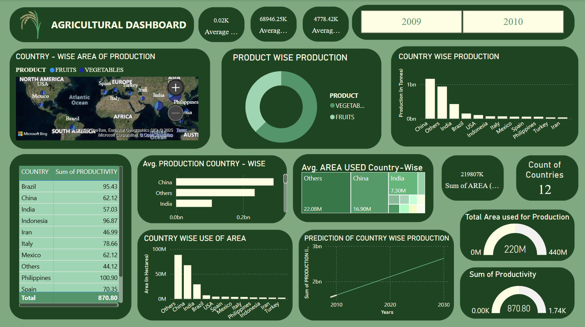

<div align="center">

<!-- Header Banner -->


<em>A Country-Wise Analysis of Production, Productivity &amp; Area</em>

<!-- Badges -->


<br/>

[](https://github.com/BabithaRavindra)
[](https://linkedin.com/in/babitha-ravindra)

</div>

---

## Table of Contents

- [Project Overview](#project-overview)
- [Dashboard Preview](#dashboard-preview)
- [Dataset Information](#dataset-information)
- [Methodology](#methodology)
- [Key Insights & Findings](#key-insights--findings)
- [Tools & Technologies](#tools--technologies)
- [Repository Structure](#repository-structure)
- [Author](#author)

---

## Project Overview

> *"Agricultural dashboards are critical decision-making instruments — providing a clear summary of key performance indicators to drive strategic planning and operational efficiency."*

This project presents a comprehensive **Power BI dashboard** built to analyze agricultural production statistics across **12 countries** for the years **2009–10 and 2010–11**. The data was sourced from [data.gov.in](https://data.gov.in), India's official open government data portal.

The dashboard enables stakeholders — from policymakers and farm managers to researchers and investors — to make data-driven decisions on production optimization, resource allocation, and long-term agricultural planning.

**Core objectives of this project:**

| Objective | Description |
|-----------|-------------|
| Geographic Analysis | Map country-wise area under agricultural production |
| Production Comparison | Compare output volumes by country and product type |
| Trend Identification | Identify growth patterns across years and regions |
| Forecasting | Predict future country-wise production trends using DAX |
| Productivity Assessment | Measure output efficiency per unit of land |

---

## Dashboard Preview

<div align="center">



*Interactive Power BI Dashboard — filterable by Year (2009 / 2010) and Product Category (Fruits / Vegetables)*

</div>

The dashboard features **12 interactive visuals** including:
- **Geospatial Map** — Country-wise area of production
- **Donut Chart** — Product-wise production split (Fruits vs. Vegetables)
- **Bar Charts** — Country-wise total production and area usage
- **Treemap** — Average area used per country
- **Line Chart** — Predictive production trend (2010–2030)
- **Gauge Visuals** — Total area utilized and sum of productivity
- **KPI Cards** — Average productivity, production, and area at a glance

---

## Dataset Information

- **Source:** [data.gov.in](https://data.gov.in) — Ministry of Agriculture & Farmers Welfare, Government of India
- **Coverage:** 12 countries across Asia, Europe, North & South America
- **Time Period:** 2009–10 and 2010–11
- **Product Categories:** Fruits & Vegetables

| Column | Description | Type |
|--------|-------------|------|
| `Country` | Geographic location of production | Categorical |
| `Product` | Crop type — Fruits or Vegetables | Categorical |
| `Year` | Data collection period | Time-Series |
| `Area (Hectares)` | Land area used for production | Numerical |
| `Production (Tonnes)` | Total agricultural output volume | Numerical |
| `Productivity` | Output per unit of input (Tonnes/Hectare) | Numerical |

> **Data Quality Note:** Missing values existed for Iran and Turkey in 2010 (fruits & vegetables respectively). These records were removed during the data cleaning phase to ensure analytical accuracy.

The workbook contains three structured sheets:
- `Original Dataset` — Raw data as downloaded
- `Transformed Dataset` — Aggregated and reshaped for Power BI
- `Cleaned Dataset` — Final cleaned version used for visualization

---

## Methodology

The project followed a structured **three-phase analytical pipeline:**

```
Data Collection  ──►  Data Processing  ──►  Dashboard Creation
  data.gov.in         Excel (3 sheets)       Power BI Desktop
```

### Phase 1 — Data Collection & Pre-processing
- Downloaded raw dataset from data.gov.in
- Structured into `Original`, `Transformed`, and `Cleaned` Excel sheets
- Handled missing values via record removal for affected country-year combinations
- Derived `Productivity` metric (Production ÷ Area)

### Phase 2 — Data Analysis
- **Comparative Analysis:** Performance benchmarking across countries and product types
- **Trend Analysis:** Year-over-year changes in production and area usage
- **Correlation Analysis:** Relationship between land area and production output

### Phase 3 — Dashboard Creation (Power BI)
- Imported `Transformed Dataset` sheet into Power BI Desktop
- Designed custom background in PowerPoint using hex colors `#4c956c` (base) and `#2c6e49` (panels)
- Built 12 visuals with consistent dark-green theme, light borders, and interactive slicers
- Created DAX measures for forecasting, aggregates, and computed KPIs

---

## Key Insights & Findings

<div align="center">

| # | Insight |
|---|---------|
| 1 | **China leads** in total production volume, followed by India and Brazil |
| 2 | Overall production shows a **positive growth trend** from 2009–10 to 2010–11 |
| 3 | **Vegetables dominate** the product-wise production split globally |
| 4 | **Indonesia and Philippines** show high productivity relative to land used |
| 5 | **Others (aggregated)** category holds the largest land area under production |
| 6 | Forecasts project **China and India** will maintain production dominance through 2030 |
| 7 | A significant **productivity gap** exists between high- and low-performing countries |

</div>

### Challenges Identified
- **Productivity Gap** — Wide disparity across countries signals room for improvement via technology adoption
- **Land Utilization Efficiency** — Extensive land use without proportional productivity gain is unsustainable
- **Regional Imbalances** — Several regions require targeted investment and infrastructure development
- **Data Gaps** — Missing records highlight the need for stronger agricultural data collection systems

---

## Tools & Technologies

<div align="center">

| Tool | Purpose |
|------|---------|
|  | Dashboard creation, DAX measures, interactive visuals |
|  | Data collection, transformation, and cleaning |
|  | Custom dashboard background design |
|  | Primary open-source data portal |

</div>

---

## Repository Structure
```
Agricultural-Dashboard/
├── 20250215_Agricultural-Data-Analysis_Dataset.xls           # Excel workbook (Original, Transformed & Cleaned sheets)
├── 20250326_Agricultural-Data-Analysis_Dashboard.png         # Dashboard screenshot preview
├── 20250326_Agricultural-Data-Analysis_Dashboard_V4.pbix     # Power BI Dashboard file
├── 20250403_Agricultural-Data-Analysis_Report.pdf            # Full project analysis report
└── README.md                                                 # Project documentation
```

---

## Author

<div align="center">

**Babitha Ravindra**
*Data Analyst | Power BI Developer*

[](https://github.com/BabithaRavindra)
[](https://linkedin.com/in/babitha-ravindra)

</div>

---

<div align="center">


*If you found this project useful, consider giving it a star.*

</div>
